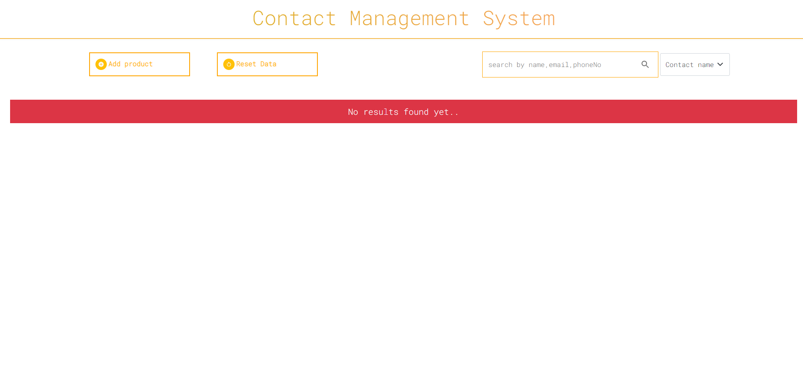
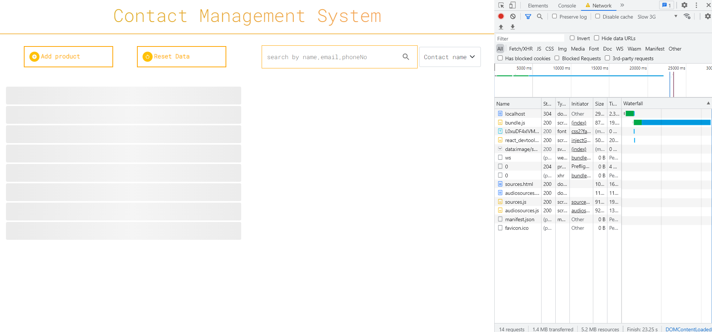
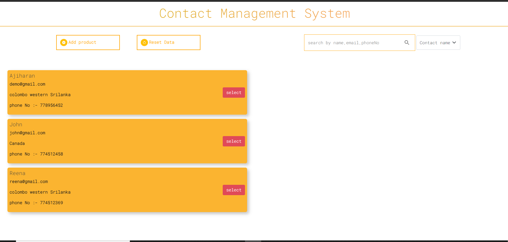

# Frontend

## Start project

- install dependencies - npm install

- run project - npm start

**packages**

- axios : used as api
- bootstrap : UI framework
- styled-components : CSS to style the apps
- formik,yup : used for form validation
- react-loading-skeleton : show skeleton effect while data fetching
- react-redux : for managing states
- react-hot-toast : display different type of toast messages

# Backend

## Start project

- install dependencies - npm install

- run project - npm start

**packages**

- cors : allows a server to indicate any origins
- dotenv : access env files
- mongoose : access mongo-db
- morgan : middleware
- express-rate-limit : prevent from DOS attack
- helmet : prevent sql injection
- express : nodejs framework

## Note

`without restarting server every time install nodemon package as globally`

**Screenshots**

